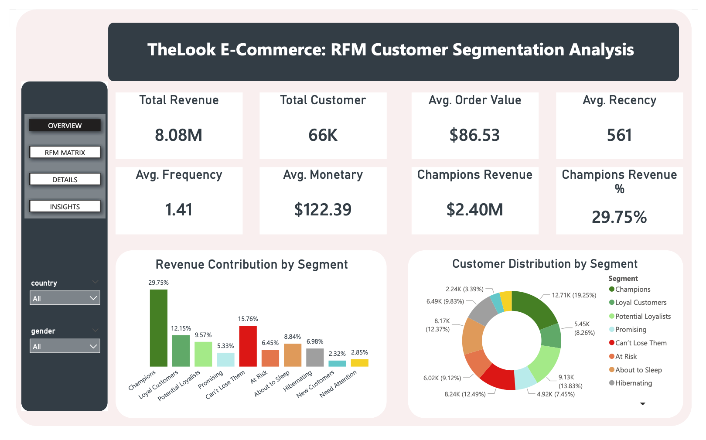
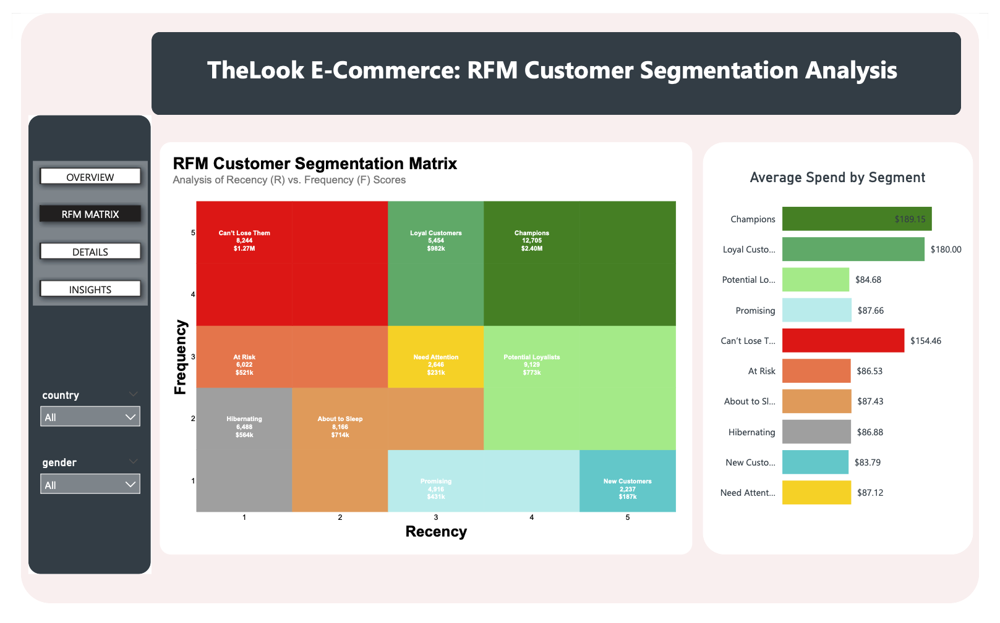
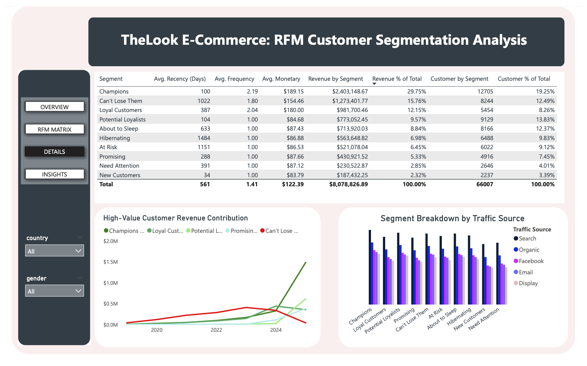
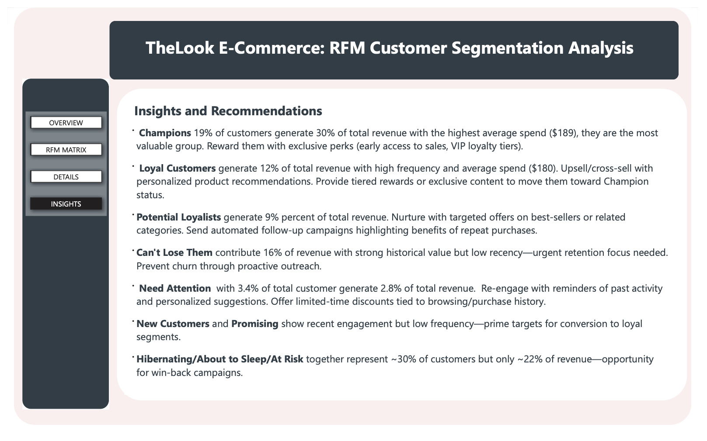

# TheLook E-Commerce: RFM Customer Segmentation Analysis

  
  

 

**Power BI + BigQuery Public Dataset** | End-to-End RFM Customer Segmentation for a Fashion E-Commerce Retailer

## Overview
This **Power BI dashboard** delivers a complete RFM (Recency, Frequency, Monetary) analysis on **TheLook**, a fictional fashion e-commerce platform. Using the public BigQuery dataset, the project segments 66,007 customers into 10 actionable groups, highlights revenue concentration, and provides clear marketing recommendations to drive retention and growth.

**Key Business Impact**  
- **Champions** (19.25% of customers) generate **29.75%** of total revenue ($2.40M).  
- **Can’t Lose Them** segment contributes **15.76%** of revenue but shows very low recency.  
- High-value segments (Champions + Can’t Lose Them + Loyal Customers) = **~57%** of revenue from  **~40%** of customers.  
- Identified win-back potential for targeted campaigns.

## Dataset
- **Source**: Google BigQuery Public Dataset  
  `bigquery-public-data.thelook_ecommerce`
- **Tables used**: `users`, `orders`, `order_items`
- **Time range**: Full available history (2019–2025)
- **Key metrics extracted**: 66,007 unique customers, 8.08M revenue, 1.41 avg orders per customer

## Tools & Tech Stack
- **Data Source**: Google BigQuery
- **Data Modeling & Transformation**: Power BI Desktop + Power Query
- **Calculations**: DAX for RFM scores and KPIs
- **Visualization**: Power BI (interactive slicers for country/gender, charts, table, dynamic cards), Deneb declarative grammar (Vega-Lite framework) for RFM Matrix
- **RFM Logic**: Industry-standard 5×5 matrix (quintile scoring) with 2D view  due to high F-M correlation in fashion retail

## RFM Methodology
Customers are scored 1–5 (quintiles) on:
- **Recency** — Days since last purchase
- **Frequency** — Total orders

**Standard 10-Segment Mapping** (CleverTap)

| Segment                | R Score | F Score | Description (Behavior)                                      | Strategy (Recommended Action) |
|------------------------|---------|---------|-------------------------------------------------------------|-------------------------------|
| **Champions**          | 4–5     | 4–5     | Most valuable customers who buy recently, frequently, and spend the most | **Reward & Advocacy:** VIP perks, early access to new launches, and referral rewards. |
| **Loyal Customers**    | 3–4     | 4–5     | Reliable high-frequency buyers with strong repeat purchase habit | **Retention & Value:** Drive Upsell higher-tier products and invite to tiered loyalty programs. |
| **Potential Loyalists**| 4–5     | 2–3     | Recent customers with high potential but not yet frequent buyers | **Nurture & Frequency:**  Targeted offers on best-sellers or related categories and personalized product recommendations. |
| **Promising**          | 3–4     | 0–1     | Fairly recent active customers with low frequency and low spend | **Conversion:** Time-limited "Second Purchase" coupons to build a buying habit. |
| **Can’t Lose Them**    | 1–2     | 4–5     | High-value customers with excellent past behavior but now at serious risk of churn | **Urgent Recovery:** High-value win-back offers and personal outreach to prevent churn. |
| **At Risk**            | 1–2     | 3–4     | Valuable past heavy buyers showing clear signs of declining engagement | **Re-engagement:** Personalized emails and surveys to identify and fix friction points. |
| **About to Sleep**     | 2–3     | 1–2     | Customers whose purchase activity is gradually fading away | **Awareness:** Share "New Arrivals" and "Back in Stock" updates to stay top-of-mind. |
| **Hibernating**        | 1–2     | 1–2     | Long-inactive customers with very low engagement and spend | **Last-Chance:** Aggressive, automated discount-led campaigns via low-cost channels. |
| **New Customers**      | 4–5     | 0–1     | Brand-new first-time buyers who just made their initial purchase | **Onboarding:** Welcome series, brand education, and a "First-Time Buyer" discount. |
| **Need Attention**     | 2–3     | 2–3     | Moderately valuable customers who are starting to slip away | **Retention:** Re-engage immediately with timely reminders and personalized limited-time offers. |

## Key Findings
- **Total Revenue**: $8,078,827
- **Total Customers**: 66,007
- **Avg Order Value**: $86.53
- **Avg Recency**: 561 days
- **Avg Frequency**: 1.41 orders
- **Avg Monetary**: $122.39

**Revenue Contribution by Segment** (top 3):
- Champions: $2.40M (29.75%)
- Can’t Lose Them: $1.27M (15.76%)
- Loyal Customers: $982K (12.15%)

**Customer Distribution**:
- Champions: 12,705 (19.25%)
- Potential Loyalists: 9,129 (13.83%)
- Can’t Lose Them: 8,244 (12.49%)

## Dashboard Screenshots

  
  

## How to Run / Reproduce

1. **Download the `.pbix` file** from this repository.

2. **Open the file in Power BI Desktop** (free version is enough).  
   All visuals, including the Deneb RFM matrix, will load immediately.

3. **Explore the dashboard** using the **Country** and **Gender** slicers.

**About the RFM Matrix Visual (Deneb)**

The advanced **RFM Customer Segmentation Matrix** (Recency × Frequency grid with segment colors, customer counts, revenue, and tooltips) on page 2 was created using **Deneb** — a powerful Vega-Lite custom visual for Power BI.

- I used the **standalone version** of Deneb, which is **fully embedded** inside the `.pbix` file.  
- **No installation is required** for anyone who opens the dashboard.

**If you want to recreate the visual:**
- Download the exact standalone version I used:  
  **[Deneb Standalone 1.8.2](https://github.com/deneb-viz/deneb/releases/download/1.8.2.0/Deneb_STANDALONE.1.8.2.20251007.60fa2e6.pbiviz)**
- In Power BI Desktop: **Visualizations → ... → Import a visual from a file** → select the downloaded `.pbiviz` file.  
- Then click on the Deneb visual type → **Format pane → Edit** to open the JSON editor.

## Skills Demonstrated
- Power BI data modeling & DAX  
- RFM analysis & customer lifecycle segmentation  
- Business translation into actionable marketing strategy  
- Interactive dashboard design for stakeholders

---

**Built as a portfolio project** to showcase end-to-end BI and customer analytics skills for data analyst / business intelligence roles.

## License
This project is licensed under the MIT License.
